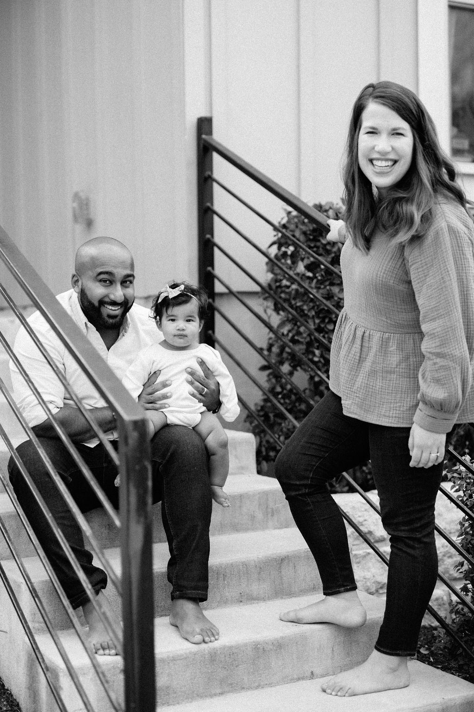

Hi there! I have 6 years of experience as a design team lead and UX designer at IBM. Some of my superpowers are enterprise UX design, design strategy, content strategy, collaborating with cross-functional teams, and stakeholder management. I have deep experience around developing empowered teams, using tools to support best practices, and promoting healthy ways of working.

I am a wife to Brice and mom to my daughter, Ellery. I earned a Master of Design in Communication Planning & Information Design from Carnegie Mellon University. Before that, I graduated from Texas A&M University with a Bachelor's degree in architecture.

### Contact me

[robynlhammond@gmail.com](mailto:robynlhammond@gmail.com)
